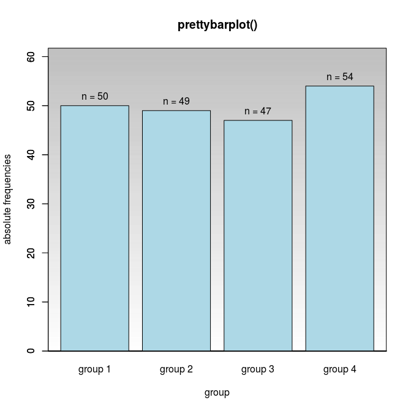
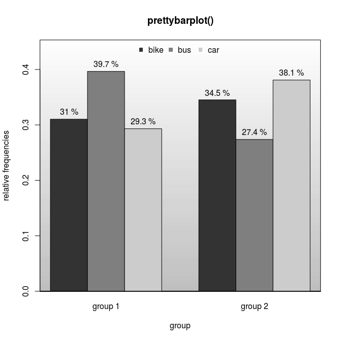
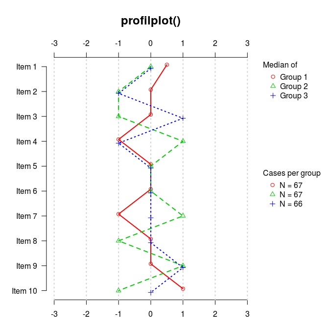
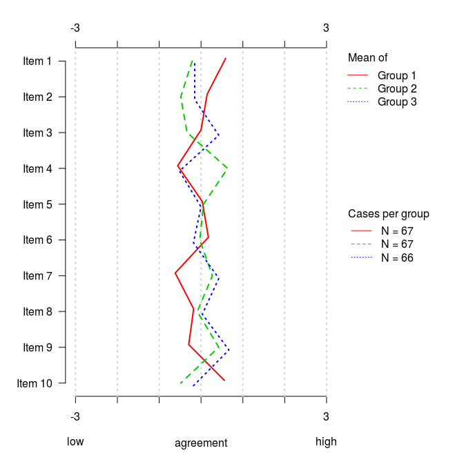
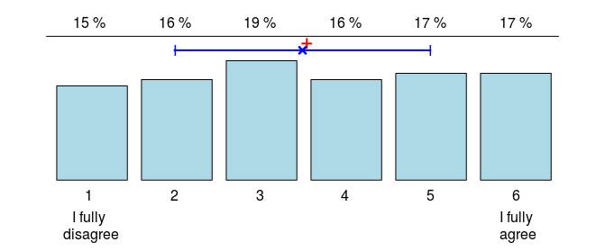
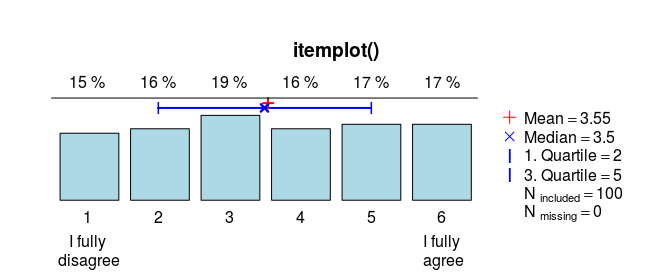
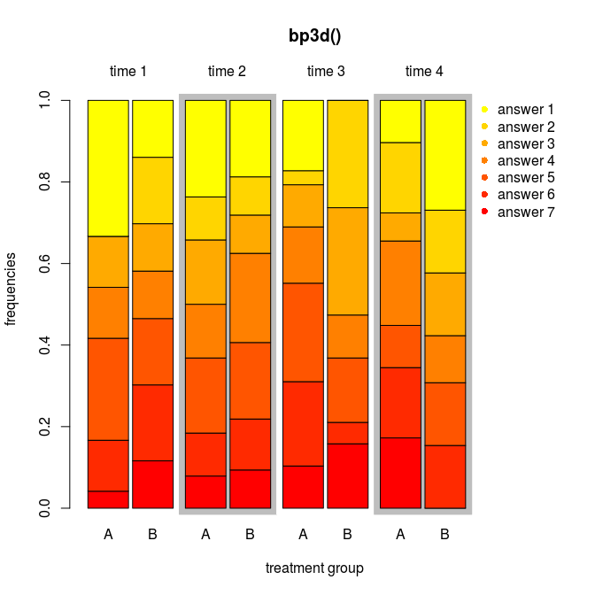

## graphing
This package contains some convenient graphic functions for the statistical software R.

### prettybarplot()
```r
x<-sample(letters[1:4],100,T)
y<-sample(1:3,100,T)
# one dimensional absolute frequencies
prettybarplot(table(x)) 
# two dimensional relative frequencies
prettybarplot(prop.table(table(x,y))) 
``` 



### profileline()
```r
matrix<-data.frame(matrix(sample(-3:3,1000,T),ncol=20))
names(matrix)<-paste("Item",1:20); g<-paste("Group",rep(1:3,length=200))
for(i in 1:dim(matrix)[2]){matrix[,i]<-factor(matrix[,i],-3:3,c("fully disagree","2","3","4","5","6","fully agree"))}
profileline(matrix,g,main="",N_legend=T,pch="",type="Mean",ex=T,low="low",high="high",xlab="agreement")
``` 


### itemplot()
```r
x<-factor(sample(letters[1:6],100,T))
itemplot(x,main="itemplot()",labels=c("I fully\n disagree","I fully\n agree"),legend=F)
itemplot(x,main="itemplot()",labels=c("I fully\n disagree","I fully\n agree"))
``` 


### CIV(), confidence interval violin plot
```r
x<-sample(paste("group",1:4),100,T)
y<-10+as.numeric(factor(x))*2+rnorm(length(x))
CIV(x,y,main="Confidence Intervall Violin Plot")

``` 


### bp3d(), barplot for 3 dimensional contingency tables
```r
x <- sample(paste("time",1:4),240,T)
z <- rep(c("A","B"),each=120)
y <- paste("answer",sample(1:7,240,T))
bp3d(x,z,y,main="bp3d()",xlab="treatment group")

``` 


