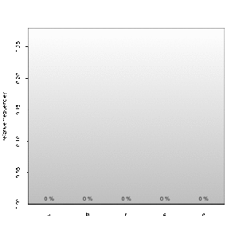

# graphing
Some convenient graphic functions for R

## prettybarplot()
```r
x<-sample(letters[1:4],100,T)
y<-sample(1:3,100,T)
prettybarplot(table(x))
prettybarplot(table(x,y))
``` 


## ani.barplot()
```r
x<-sample(letters[1:4],100,T)
anibarplot(table(x))
``` 

