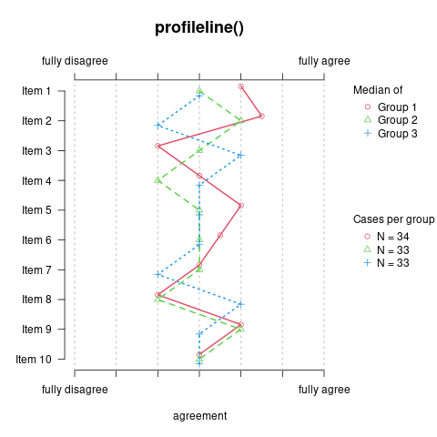

## The 'graphing' package
This package contains some convenient graphic functions for the statistical software R.

### Built With
* [R Core 3.6](https://www.r-project.org)
* [devtools](https://github.com/r-lib/devtools) package

### Depends on
The function igraph2() depends on the R packages
* [tm](https://cran.r-project.org/web/packages/tm/tm.pdf)
* [igraph](https://igraph.org/r/)

The function worldmap2() depends on the R packages
* [worldmap](https://cran.r-project.org/web/packages/rworldmap/rworldmap.pdf)
* [countrycode](https://cran.r-project.org/web/packages/countrycode/countrycode.pdf)
* [geosphere](https://cran.r-project.org/web/packages/geosphere/geosphere.pdf)
* [rgeos](https://cran.r-project.org/web/packages/rgeos/rgeos.pdf)
* [RColorBrewer](https://cran.r-project.org/web/packages/RColorBrewer/RColorBrewer.pdf)

The function orcid2name() depends on the R package
* [rorcid](https://cran.r-project.org/web/packages/rorcid/rorcid.pdf)

<!-- GETTING STARTED -->
## Getting Started

To install **graphing** run the following steps:

### Installation
1. Install and load the [devtools](https://github.com/r-lib/devtools) package
``` r
# Install the devtools package
install.packages("devtools")
# Load the devtools package
library(devtools)
``` 
2. Install *graphing from [github](https://github.com/ingmarboeschen/graphing)
``` r
# Install JATSdecoder from github
install_github("ingmarboeschen/graphing")
```
<!-- Examples -->
### Examples

### prettybarplot()
```r
x<-sample(letters[1:4],100,T)
y<-sample(1:3,100,T)
# one dimensional absolute frequencies
prettybarplot(table(x)) 
# two dimensional relative frequencies
prettybarplot(prop.table(table(x,y))) 
``` 


<!-- USAGE -->
## Usage


### profileline()
```r
matrix<-data.frame(matrix(sample(-3:3,1000,T),ncol=10))
names(matrix)<-paste("Item",1:10); g<-paste("Group",rep(1:3,length=100))
for(i in 1:dim(matrix)[2]){matrix[,i]<-factor(matrix[,i],-3:3,c("fully disagree","2","3","4","5","6","fully agree"))}
profileline(matrix,g,main="profileline()",N_legend=T,type="Median",ex=T,xlab="agreement")
profileline(matrix,g,main="",N_legend=T,pch="",type="Mean",ex=T,low="low",high="high",xlab="agreement")
``` 


### itemplot()
```r
x<-factor(sample(letters[1:6],100,T))
itemplot(x,main="itemplot()",labels=c("I fully\n disagree","I fully\n agree"),legend=F)
itemplot(x,main="itemplot()",labels=c("I fully\n disagree","I fully\n agree"))
``` 


### CIV(), confidence interval violin plot
```r
x<-sample(paste("group",1:4),100,T)
y<-10+as.numeric(factor(x))*2+rnorm(length(x))
CIV(x,y,main="Confidence Intervall Violin Plot")

``` 


### bp3d(), barplot for 3 dimensional contingency tables
```r
x <- sample(paste("time",1:4),240,T)
z <- rep(c("A","B"),each=120)
y <- paste("answer",sample(1:7,240,T))
bp3d(x,z,y,main="bp3d()",xlab="treatment group")

``` 


### bp3d(), stacked area chart for 2 dimensional contingency tables
```r
x<-sample(2010:2020,1000,T,.2+(1:11)*.5)
y<-sample(paste("category",LETTERS[1:10]),1000,T)
par(mar=c(4,4,2,5))
stacked.area.chart(table(x,y),main="stacked.area.chart()",ylab="h(x)",xlab="year",reorder=T)
stacked.area.chart(prop.table(table(x,y),m=1),main="stacked.area.chart()",ylab="f(x)",xlab="year")

``` 


### catplot(), draws conditioned or unconditioned frequency table of two multi categorial variables
```r
x<-sample(2010:2020,1000,T,.2+(1:11)*.5)
y<-sample(paste("group",LETTERS[1:10]),1000,T)
catplot(x,y,main="catplot()",xlab="year")
``` 


### multi.line(), draws multiple regression or lowess lines with a grouping variable
```r
data(ChickWeight)
attach(ChickWeight)
Diet<-paste("Diet",ChickWeight$Diet)
multi.line(x=jitter(Time,2),y=weight,group=Diet,points=T,main="multi.line()",xlab="time",ylab="weight")
multi.line(x=jitter(Time,2),y=weight,group=Diet,points=F,main="multi.line() without points with lowess line",xlab="time",ylab="weight",type="lowess")

``` 


### igraph2(), network graph from list input
```r
x<-list(
     c("Laura","Ingmar"),
     c("Peter","Renate","Ingmar","Andrea"),
     c("Nassim","Ingmar","Sergej"),
     c("Laura","Rike","Andra"),
     c("Marlene","Nassim","Christina","Sabine"),
     c("Bela","Ingmar","Mariola","Nassim"),
     c("Gloria","Kim","Olek","Bolek"))
igraph2(x)
``` 


### worlmap2(), country and country connection frequency from list of countries
```r
 x<-list(c("Germany","Austria","S. Korea"),
 c("Germany","Austria","S. Korea"),c("Germany","Austria","S. Korea"),
 c("Germany","Spain"),c("Germany","Spain"),c("United States","Germany"),
 c("Germany","Cuba","Bolivia","South Africa"))
worldmap2(x)
# Note: arguments legend1 and legend2 need adjustments that dependend on the resolution of the resulting graph. 
``` 


### orcid2name, convert ORCID author identification codes to 'surname, name'
```r
# Note: You need an ORCID account to authenticate to the ORCID api
name<-c("https://orcid.org/0000-0003-1159-3991")
orcid2name(name)
```

